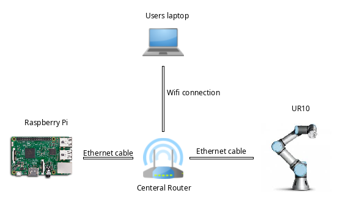

<BODY LANG="en-US" DIR="LTR">

	
 
	

  

Design
Document

Project
RCA

Project:
Robot Controlling Arm

Written
by: INF2E

Client:
 Mark van der Staaij,  Bert Meijerink

29
March 2019

Emmen,
Netherlands

 

 

<TABLE WIDTH=624 CELLPADDING=7 CELLSPACING=0>
	<COL WIDTH=98>
	<COL WIDTH=119>
	<COL WIDTH=365>
	<TR>
		<TD COLSPAN=3 WIDTH=610 HEIGHT=14 VALIGN=TOP BGCOLOR="#4a86e8" STYLE="border-top: none; border-bottom: none; border-left: none; border-right: 1px dashed #ffffff; padding-top: 0in; padding-bottom: 0in; padding-left: 0in; padding-right: 0.07in">
			
DRAWN
			UP BY INF2E

		</TD>
	</TR>
	<TR VALIGN=TOP>
		<TD WIDTH=98 STYLE="border-top: 1.00pt dashed #cccccc; border-bottom: 1.00pt dashed #cccccc; border-left: none; border-right: 1.00pt solid #d9d9d9; padding-top: 0.07in; padding-bottom: 0.07in; padding-left: 0in; padding-right: 0.07in">
			
Romandy

		</TD>
		<TD WIDTH=119 STYLE="border-top: 1.00pt dashed #cccccc; border-bottom: 1.00pt dashed #cccccc; border-left: 1.00pt solid #d9d9d9; border-right: 1.00pt solid #d9d9d9; padding: 0.07in">
			
Richardson

		</TD>
		<TD WIDTH=365 STYLE="border-top: 1.00pt dashed #cccccc; border-bottom: 1.00pt dashed #cccccc; border-left: 1.00pt solid #d9d9d9; border-right: none; padding-top: 0.07in; padding-bottom: 0.07in; padding-left: 0.07in; padding-right: 0in">
			
romandy.richardson@student.stenden.com

		</TD>
	</TR>
	<TR VALIGN=TOP>
		<TD WIDTH=98 HEIGHT=22 BGCOLOR="#efefef" STYLE="border-top: 1.00pt dashed #cccccc; border-bottom: none; border-left: none; border-right: 1.00pt solid #d9d9d9; padding-top: 0.07in; padding-bottom: 0in; padding-left: 0in; padding-right: 0.07in">
			
Danylo

		</TD>
		<TD WIDTH=119 BGCOLOR="#efefef" STYLE="border-top: 1.00pt dashed #cccccc; border-bottom: none; border-left: 1.00pt solid #d9d9d9; border-right: 1.00pt solid #d9d9d9; padding-top: 0.07in; padding-bottom: 0in; padding-left: 0.07in; padding-right: 0.07in">
			
Znamerovskyi

		</TD>
		<TD WIDTH=365 BGCOLOR="#efefef" STYLE="border-top: 1.00pt dashed #cccccc; border-bottom: none; border-left: 1.00pt solid #d9d9d9; border-right: none; padding-top: 0.07in; padding-bottom: 0in; padding-left: 0.07in; padding-right: 0in">
			
danylo.znamerovskyi@student.stenden.com

		</TD>
	</TR>
	<TR VALIGN=TOP>
		<TD WIDTH=98 HEIGHT=22 BGCOLOR="#efefef" STYLE="border-top: 1.00pt dashed #cccccc; border-bottom: none; border-left: none; border-right: 1.00pt solid #d9d9d9; padding-top: 0.07in; padding-bottom: 0in; padding-left: 0in; padding-right: 0.07in">
			
Joris

		</TD>
		<TD WIDTH=119 BGCOLOR="#efefef" STYLE="border-top: 1.00pt dashed #cccccc; border-bottom: none; border-left: 1.00pt solid #d9d9d9; border-right: 1.00pt solid #d9d9d9; padding-top: 0.07in; padding-bottom: 0in; padding-left: 0.07in; padding-right: 0.07in">
			
Rietveld

		</TD>
		<TD WIDTH=365 BGCOLOR="#efefef" STYLE="border-top: 1.00pt dashed #cccccc; border-bottom: none; border-left: 1.00pt solid #d9d9d9; border-right: none; padding-top: 0.07in; padding-bottom: 0in; padding-left: 0.07in; padding-right: 0in">
			
joris.rietveld@student.stenden.com

		</TD>
	</TR>
	<TR VALIGN=TOP>
		<TD WIDTH=98 HEIGHT=22 BGCOLOR="#efefef" STYLE="border-top: 1.00pt dashed #cccccc; border-bottom: none; border-left: none; border-right: 1.00pt solid #d9d9d9; padding-top: 0.07in; padding-bottom: 0in; padding-left: 0in; padding-right: 0.07in">
			
Tarik

		</TD>
		<TD WIDTH=119 BGCOLOR="#efefef" STYLE="border-top: 1.00pt dashed #cccccc; border-bottom: none; border-left: 1.00pt solid #d9d9d9; border-right: 1.00pt solid #d9d9d9; padding-top: 0.07in; padding-bottom: 0in; padding-left: 0.07in; padding-right: 0.07in">
			
Arrindell

		</TD>
		<TD WIDTH=365 BGCOLOR="#efefef" STYLE="border-top: 1.00pt dashed #cccccc; border-bottom: none; border-left: 1.00pt solid #d9d9d9; border-right: none; padding-top: 0.07in; padding-bottom: 0in; padding-left: 0.07in; padding-right: 0in">
			
tarik.arrindell@student.stenden.com

		</TD>
	</TR>
</TABLE>

 

 

<TABLE WIDTH=602 CELLPADDING=7 CELLSPACING=0>
	<COL WIDTH=91>
	<COL WIDTH=58>
	<COL WIDTH=124>
	<COL WIDTH=273>
	<TBODY>
		<TR>
			<TD COLSPAN=4 WIDTH=588 HEIGHT=18 VALIGN=TOP BGCOLOR="#6d9eeb" STYLE="border-top: none; border-bottom: none; border-left: none; border-right: 1.00pt solid #000000; padding-top: 0in; padding-bottom: 0in; padding-left: 0in; padding-right: 0.07in">
				
Revision
				history

			</TD>
		</TR>
		<TR VALIGN=TOP>
			<TD WIDTH=91 STYLE="border-top: none; border-bottom: 1.00pt dashed #d9d9d9; border-left: none; border-right: 1.00pt solid #d9d9d9; padding-top: 0in; padding-bottom: 0.07in; padding-left: 0in; padding-right: 0.07in">
				
<B>Date</B>

			</TD>
			<TD WIDTH=58 STYLE="border-top: none; border-bottom: 1.00pt dashed #d9d9d9; border-left: 1.00pt solid #d9d9d9; border-right: 1.00pt solid #d9d9d9; padding-top: 0in; padding-bottom: 0.07in; padding-left: 0.07in; padding-right: 0.07in">
				
<B>Version</B>

			</TD>
			<TD WIDTH=124 STYLE="border-top: none; border-bottom: 1.00pt dashed #d9d9d9; border-left: 1.00pt solid #d9d9d9; border-right: 1.00pt solid #d9d9d9; padding-top: 0in; padding-bottom: 0.07in; padding-left: 0.07in; padding-right: 0.07in">
				
<B>Authors</B>

			</TD>
			<TD WIDTH=273 STYLE="border-top: none; border-bottom: 1.00pt dashed #d9d9d9; border-left: 1.00pt solid #d9d9d9; border-right: none; padding-top: 0in; padding-bottom: 0.07in; padding-left: 0.07in; padding-right: 0in">
				
<B>Change
				Log</B>

			</TD>
		</TR>
	</TBODY>
	<TBODY>
		<TR VALIGN=TOP>
			<TD WIDTH=91 STYLE="border-top: none; border-bottom: 1.00pt dashed #d9d9d9; border-left: none; border-right: 1.00pt solid #d9d9d9; padding-top: 0in; padding-bottom: 0.07in; padding-left: 0in; padding-right: 0.07in">
				
05/04/2019

			</TD>
			<TD WIDTH=58 STYLE="border-top: none; border-bottom: 1.00pt dashed #d9d9d9; border-left: 1.00pt solid #d9d9d9; border-right: 1.00pt solid #d9d9d9; padding-top: 0in; padding-bottom: 0.07in; padding-left: 0.07in; padding-right: 0.07in">
				
0.1.0

			</TD>
			<TD WIDTH=124 STYLE="border-top: none; border-bottom: 1.00pt dashed #d9d9d9; border-left: 1.00pt solid #d9d9d9; border-right: 1.00pt solid #d9d9d9; padding-top: 0in; padding-bottom: 0.07in; padding-left: 0.07in; padding-right: 0.07in">
				
INF2E

			</TD>
			<TD WIDTH=273 STYLE="border-top: none; border-bottom: 1.00pt dashed #d9d9d9; border-left: 1.00pt solid #d9d9d9; border-right: none; padding-top: 0in; padding-bottom: 0.07in; padding-left: 0.07in; padding-right: 0in">
				
The initial version
				of the document.

			</TD>
		</TR>
	</TBODY>
	<TBODY>
		<TR VALIGN=TOP>
			<TD WIDTH=91 STYLE="border-top: none; border-bottom: 1.00pt dashed #d9d9d9; border-left: none; border-right: 1.00pt solid #d9d9d9; padding-top: 0in; padding-bottom: 0.07in; padding-left: 0in; padding-right: 0.07in">
				
05/04/2019

			</TD>
			<TD WIDTH=58 STYLE="border-top: none; border-bottom: 1.00pt dashed #d9d9d9; border-left: 1.00pt solid #d9d9d9; border-right: 1.00pt solid #d9d9d9; padding-top: 0in; padding-bottom: 0.07in; padding-left: 0.07in; padding-right: 0.07in">
				
1.0.0

			</TD>
			<TD WIDTH=124 STYLE="border-top: none; border-bottom: 1.00pt dashed #d9d9d9; border-left: 1.00pt solid #d9d9d9; border-right: 1.00pt solid #d9d9d9; padding-top: 0in; padding-bottom: 0.07in; padding-left: 0.07in; padding-right: 0.07in">
				
INF2E

			</TD>
			<TD WIDTH=273 STYLE="border-top: none; border-bottom: 1.00pt dashed #d9d9d9; border-left: 1.00pt solid #d9d9d9; border-right: none; padding-top: 0in; padding-bottom: 0.07in; padding-left: 0.07in; padding-right: 0in">
				
First draft delivered
				to client.

			</TD>
		</TR>
	</TBODY>
	<TBODY>
		<TR VALIGN=TOP>
			<TD WIDTH=91 STYLE="border-top: none; border-bottom: 1.00pt dashed #d9d9d9; border-left: none; border-right: 1.00pt solid #d9d9d9; padding-top: 0in; padding-bottom: 0.07in; padding-left: 0in; padding-right: 0.07in">
				
06/04/2019

			</TD>
			<TD WIDTH=58 STYLE="border-top: none; border-bottom: 1.00pt dashed #d9d9d9; border-left: 1.00pt solid #d9d9d9; border-right: 1.00pt solid #d9d9d9; padding-top: 0in; padding-bottom: 0.07in; padding-left: 0.07in; padding-right: 0.07in">
				
1.0.1

			</TD>
			<TD WIDTH=124 STYLE="border-top: none; border-bottom: 1.00pt dashed #d9d9d9; border-left: 1.00pt solid #d9d9d9; border-right: 1.00pt solid #d9d9d9; padding-top: 0in; padding-bottom: 0.07in; padding-left: 0.07in; padding-right: 0.07in">
				
Joris
				Rietveld

			</TD>
			<TD WIDTH=273 STYLE="border-top: none; border-bottom: 1.00pt dashed #d9d9d9; border-left: 1.00pt solid #d9d9d9; border-right: none; padding-top: 0in; padding-bottom: 0.07in; padding-left: 0.07in; padding-right: 0in">
				
Updated the reference
				list and added the missing UR10 chapter under hardware

			</TD>
		</TR>
	</TBODY>
</TABLE>

# Table Of Contents

[TOC]: # " "

- [Table Of Contents](#table-of-contents)
- [System Overview](#system-overview)
- [Hardware](#hardware)
    - [Raspberry Pi](#raspberry-pi)
    - [Camera](#camera)
    - [Universal Robot UR10](#universal-robot-ur10)
    - [Router](#router)
- [Software](#software)
    - [OpenCV](#opencv)
    - [Python 3](#python-3)
    - [ROS](#ros)
    - [URScript](#urscript)
    - [Xmlrpc](#xmlrpc)
- [Functionality](#functionality)
    - [Dice recognition](#dice-recognition)
    - [Location tracking](#location-tracking)
    - [Object manipulation](#object-manipulation)
    - [Sorting of dice](#sorting-of-dice)
- [Code conventions](#code-conventions)
    - [Python](#python)
    - [BASH](#bash)
- [References:](#references)
- [Appendix 1](#appendix-1)
    - [The current hardware](#the-current-hardware)
- [Appendix 2](#appendix-2)
    - [Specifications raspberry pi 3 Model B+](#specifications-raspberry-pi-3-model-b)
- [Appendix 3](#appendix-3)
    - [Specifications Universal Robot UR10](#specifications-universal-robot-ur10)

 

 

 

# System Overview

 

The entire system consists
of the robotic arm and the camera. The robotic arm must be able to
pick up physical dices and then sort them. The dices are sorted by
numbers and the sorting is done with the magnetic gripper and camera.
This can also determine the location of the dices and is done by the
means of a grid. The camera looks at which positions on the grid a
dice is located. These dices will be laid in a fix position on the
grid for the robot arm. This is then passed on to the robotic arm, so
it knows where to pick up the dices. It is then up to the robotic arm
to place the dices in the right in sorted order on to another fixed
position on the grid.

At this stage of the
project, the dices are always at a fixed location. This has been
agreed to keep the project realistic for this time span, while at the
same time thinking of the future when there are several locations in
a prosecution of this project.

 

The Project team is solely
responsible for the camera part of the system. The Project team must
select a suitable camera, hardware, and software.

 

 

# Hardware

## Raspberry Pi

The computer vision system will be run
on a raspberry pi connected to the controller of the universal robot
UR10. The raspberry pi installed on the end of the arm of the UR10 is
a "Raspberry Pi 3 Model B+". At the time of writing, this is the
latest model of the pi but the software would probably also work on
succeeding models. It could probably also be ported to work on any of
the preceding versions of the pi but much slower because the OpenCV
library which is required by our software is quite resource
intensive.

 

See appendix 2 for detailed
specifications of the raspberry pi used in this project.

 

## Camera

At the end of the UR10, there is a
colour camera connected to the pi over USB. For our project, it
wouldn't be necessary to use a colour camera because we will convert
the pictures to grayscale before sending them to OpenCV for object
detection. This setup is for relative object detection It is unclear
at the moment if our system also needs to work with static object
detection. Static means that the camera will be set up at a fixed
position separate of the UR10.

 

## Universal Robot UR10

The UR10 is the robot that will be used
to manipulate the dices placed on the grid. It is stationed in a
closed off environment inside the room 1.015, this because it is not
allowed for students to be within the ams reach when its operational.
The room is equipped with an infrared sensor that gets triggered when
a person enters while the robot is activated. If you trigger this
safety measure you will have to wait for about 5 seconds and then
push on the green button on the box placed on the right side of the
table to re-enable the robot. On the left side the UR10 controller is
placed that connects to a touchscreen that is used to configure,
program, and control the UR10.

 

See appendix 3 for detailed
specifications of the universal robot and tool used in this project.

 

## Router

Inside the closed off environment of
the UR10 there is also a router located, this router is used to
connect the raspberry pi and UR10 controller with each other over
ethernet. It also broadcasts a access point that enables us to
connect to the UR10 controller and raspberry pi mounted on the arm.
The name of the access point is: TODO
and to communicate to the UR10 controller use the ip address : IP
or IP for the raspberry
pi.

 

 

 

 

 

# Software

## OpenCV

For object detection and object
localization we are going use OpenCV, we chose this library because
the previous group research found that it was the best fit for the
project and during our research phase we came to the same conclusion.
OpenCV is an open source library initially developed by a team at
Intel but now lives on supported by a large open source development
community. It includes many modules commonly used in computer vision
applications including object recognition and has bindings for many
programming languages like C, C++, Java, and Python to name a few.

 

## Python 3

We chose to use the OpenCV python
binding to create the part of our application that will handle the
video stream, convert it and then localize the dice on the grid. We
are free to choose either python 2 or 3 but because the python 3 API
is more consistent and recommended by the official python community
we choose to use python 3. For executing our python code we use
CPython because this is the standard python interpreter and on a
raspberry pi we wouldn't gain much if we would use the JIT from
Pypy.

 

## ROS

ROS (Robot Operating System) is an
operating system commonly used in robotic applications. It has
default support for the latest version of OpenCV, Universal Robots
and Kuka (which was the robot included in the initial version of the
project). Ros can be installed on top of most Linux based systems
like Ubuntu, Debian (Raspbian) or redhat. We are going to use ROS on
top of raspbian because this is the default operating system
supported by the raspberry pi community which means it has the best
support on the raspberry pi and most learning resources.

 

## URScript

The universal robot has its own
programming language called UR Script, it's a programing language
that has some resemblance with python but it is a domain specific.
There are 2 ways we can implement our software, we could write all
our code in python and generate the URScript commands there and send
them. Or we could write our code in URScirpt and call the python code
on the raspberry pi over Xmlrpc.

 

## Xmlrpc

XML RPC is created to make a universal
standard way of calling functions over the network in an XML format.
It has implementations for any major programming language but if we
are going to use it we will use the python library.

# Functionality

 

The systems developed by INF2E contains
several functionalities to meet the robot arms requirements.

 

Below describes how the
system will be able to use the camera's input to identify the dice
and read the numbers on their faces. Within a fixed location using a
Camera and software(OpenCV). To subsequently pass this information on
to the PLC, on which the correct action is performed.

 

## Dice recognition

For object detection, the
robot's camera will work with OpenCV connected over USB.

The images from the camera
would then be converted into grayscale and then sent to openCV

for object detection.

 

## Location tracking

For location tracking the
robot's camera will be used along with the color recognition along
with the "Color Labeler". To determine the X and Y
position. The center point will be calculated for each contour of an
object. This information (X and Y) will then be stored in combination
with the color in an array. There will be 2 modes available for
recognizing color and position;

 

Mode 1 - Grid Location and
color of multiple individual objects within a grid will be collected
and forwarded to the PLC. The X and Y coordinates are 2D points that,
with the help of calibration at the future camera location, will have
to be converted to 3D coordinates that are useful for the UR15

 

Mode 2 - Fixed point
Location and color of 1 object placed at a fixed point (Center of the
camera) will be passed on to the PLC. The X and Y coordinates are 2D
points that, with the help of calibration at the future camera
location, will have to be converted to 3D coordinates that are useful
for the Kuka Robot. (Determining object color with OpenCV, 2018)

## Object manipulation

In order for the arm to move
the 3D printed di to selected area, the di will have metal printed
inside this will allow the magnetic tip of the arm to grab the dice.
In order for the Arm to move to where the di is located the location
tracking of the camera can be calculated and calibrated to move
off-center with the magnetic tip.

 

## Sorting of dice

Using the information from
Object Detection, Parameters will be set that allows OpenCV to group
individual Dice and assign the number shown by their faces, this will
allow numbers to be sorted from largest to smallest or vice versa. If
multiple di landed on the same face the Robot will prioritize the
closest duplicated dice.

# Code conventions

## Python

* PEP 20

The Zen
of Python ([++https://www.python.org/dev/peps/pep-0020/++](https://www.python.org/dev/peps/pep-0020/))

* PEP 8.0

Style
Guide for Python Code ([++https://www.python.org/dev/peps/pep-0008++](https://www.python.org/dev/peps/pep-0008))

* PEP 257

Conventions
for Docstring in Python ([++https://www.python.org/dev/peps/pep-0257/++](https://www.python.org/dev/peps/pep-0257/))

* PEP 287

reStructuredText
Docstring Format ([++https://www.python.org/dev/peps/pep-0287/++](https://www.python.org/dev/peps/pep-0287/))

* PEP 440

Version
Identification and Dependency Specification
([++https://www.python.org/dev/peps/pep-0440/++](https://www.python.org/dev/peps/pep-0440/))

 

## BASH

* Google Shell Style Guide
  ([++https://google.github.io/styleguide/shell.xml++](https://google.github.io/styleguide/shell.xml))

 

 

 

# References:

 

Universal Robots. (2018).
*The URScript Programming Language* (Version 3.5.4). Retrieved
from
http://me.umn.edu/courses/me5286/robotlab/Resources/scriptManual-3.5.4.pdf

 

Universal Robots (2018) User
Manual UR10 (Version 3.5.5) Retrieved from
https://s3-eu-west-1.amazonaws.com/ur-support-site/32464/UR10_User_Manual_en_Global-3.5.5.pdf

 

Universal Robots (2018)
PolyScope Manual (Version 3.5.5) Retrieved from
https://s3-eu-west-1.amazonaws.com/ur-support-site/32522/Software_Manual_en_Global-3.5.5.pdf

 

Universal Robots (2018)
Service Manual (Version 3.5.5) Retrieved from
https://s3-eu-west-1.amazonaws.com/ur-support-site/15739/ServiceManual_UR10_en_3.2.1.pdf

 

Universal Robots. (n.d.).
Profinet Guide - 20596. Retrieved March 29, 2019, from
[++https://www.universal-robots.com/how-tos-and-faqs/how-to/ur-how-tos/profinet-guide-20596++](https://www.universal-robots.com/how-tos-and-faqs/how-to/ur-how-tos/profinet-guide-20596)

 

Python Software Foundation
(2001) Style Guide for Python Code (PEP 8) Retrieved from
[++https://www.python.org/dev/peps/pep-0008++](https://www.python.org/dev/peps/pep-0008)

 

Python Software Foundation
(2004) The Zen of Python (PEP 20) Retrieved from
[++https://www.python.org/dev/peps/pep-0020/++](https://www.python.org/dev/peps/pep-0020/)

 

Python Software Foundation
(2001) Conventions for Docstring in Python (PEP 257) Retrieved from
[++https://www.python.org/dev/peps/pep-0257/++](https://www.python.org/dev/peps/pep-0257/)

 

Python Software Foundation
(2002) reStructuredText Docstring Format (PEP 287) Retrieved from
[++https://www.python.org/dev/peps/pep-0287/++](https://www.python.org/dev/peps/pep-0287/)

 

Python Software Foundation
(2013) Version Identification and Dependency Specification (PEP 440 )
Retrieved from [++https://www.python.org/dev/peps/pep-0440/++](https://www.python.org/dev/peps/pep-0440/)

 

Google (n.b.) Shell Style
Guide (Revision 1.26) Received from
[++https://google.github.io/styleguide/shell.xml++](https://google.github.io/styleguide/shell.xml)

 

Universal Robots (2014)
Technical specifications UR10 (EN 10/2014) Retrieved from
(https://www.universal-robots.com/media/50880/ur10_bz.pdf)

 

 

 

 

# Appendix 1

### The current hardware
configuration of the system.

There is a camera connected to the arm
of the UR 10 (Universal Robot 10). The Camera is connected over USB
to the raspberry pi 3, which is used to run the computer vision
software. The software processes the images using the OpenCV library
to determine the current state of the system and plan the next
commands needed to be sent. When the software knows what command to
send next it creates a UDP packet that will be sent over an ethernet
cable connected to the PLC (Siemens S7 1200). The PLC then translates
the commands to instructions for the UR10 and sends them over an
ethernet cable to the controller of the Universal Robot.

 

# Appendix 2

## Specifications raspberry pi 3 Model B+

* Broadcom BCM2837B0, Cortex-A53
  (ARMv8) 64-bit SoC @ 1.4GHz

* 1GB LPDDR2 SDRAM

* 2.4GHz and 5GHz IEEE
  802.11.b/g/n/ac wireless LAN, Bluetooth 4.2, BLE

* Gigabit Ethernet over USB 2.0
  (maximum throughput of 300 Mbps)

* Extended 40-pin GPIO header

* Full-size HDMI

* 4 USB 2.0 ports

* CSI camera port for connecting a
  Raspberry Pi camera

* DSI display port for connecting a
  Raspberry Pi touchscreen display

* 4-pole stereo output and composite
  video port

* Micro SD port for loading your
  operating system and storing data

* 5V/2.5A DC power input

* Power-over-Ethernet (PoE) support

# Appendix 3

## Specifications Universal Robot UR10

* 6-axis robot arm with a working
  radius of 1300 mm

* Current Software version: 1.8.2.1

* Tool: Machnet

* Tool connection: Digital IO 8

* Weight:28.9 kg

* Payload:10 kg

* Reach:1300 mm

* Joint ranges:+/- 360°

* Speed:

  * Base and Shoulder: 120°/s.

  * Elbow, Wrist 1, Wrist 2, Wrist 3:
    180°/s.

  * Tool: Typical 1 m/s.

* Repeatability: +/- 0.1 mm / (4
  mils)

* Footprint: Ø190 mm

* Degrees of freedom: 6 rotating
  joints

* Control box size (WxHxD): 475 mm x
  423 mm x 268 mm

* I/O ports:

  |-------------|------------|-----------------|
  |        | Controlbox | Tool connection |
  | Digital in  | 16         | 2               |
  | Digital out | 16         | 2               |
  | Analog in   | 2          | 2               |
  | Analog out  | 2          | -               |

* I/O power supply:

  * 24 V 2A in control box

  * 2 V/24 V 600 mA in tool

 

* Communication:

  * TCP/IP 100 Mbit: IEEE 802.3u,
    100BASE-TX

  * Ethernet socket \& Modbus TCP

* IP classification: IP54

* Collaboration
  operation:

  * 15 Advanced Safety
    Functions

  * Tested in accordance
    with:

    * EN ISO 13849:2008 PL
      d

    * EN ISO 10218-1:2011,
      Clause 5.4.3

* Materials: Aluminum,
  ABS plastic, PP plastic

* Temperature: The robot
  can work in a temperature range of 0-50°C

* Power supply:100-240
  VAC, 50-60 Hz

* Cabling:

  * Cable between robot and control
    box (6 m )

  * Cable between touchscreen and
    control box (4.5 m)

 

 